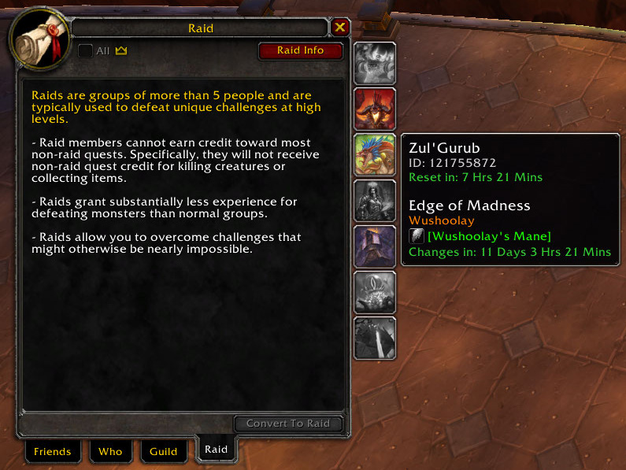

# Classic Raid Info And Resets
A World of Warcraft Classic addon to help better tracker raids.

I wanted a to be able to check raid reset times for all raids , not just the ones I was saved to.  
This addon adds a mini map icon and a modified raid Info panel that let you;  
Quickly see which raids your already saved to,  
Check when any raid reset, not just the ones you're saved,  
And has other useful information such as the current ZG maddens boss and item.

Download from [CurseForge](https://www.curseforge.com/wow/addons/classic-raid-info-and-resets)  
Checkout into your wow addon folder e.g. > D:\Program Files (x86)\World of Warcraft\_classic_era_\Interface\AddOns\ClassicRaidInfoAndResets

